# CS504 Project: Proper Boston Tour Documentation
### Contributors:
- Soojee Kim
- Soohyeok Lee

## Project Objective:
Our goal is to determine best travel experiences for incoming tourists within Greater Boston Area. Having such an immense area, people may not have their best experiences in their limited time of travel and we wanted to suggest specific areas based on various datasets for the best possible experience.

## Project Description:
We have put together the few datasets listed above and transformed the acquired datasets to see which neighborhoods within the Greater Boston Area based on which of the districts
- has greater number of landmarks to see
- has better system of public transportation
- has low crime rates.

Although we have different datasets of polygons and points, our current project model is heavily dependent on geolocation datasets. We are continuously overlooking on possible datasets to incorporate into our project to further develop user experience.

### Data sources Used:
- Analyze Boston (*data.boston.gov*)
- Boston Maps Open Data (*bostonopendata-boston.opendata.arcgis.com*)
- Massachusetts Department of Transportation (*geo-massdot.opendata.arcgis.com*)

### Datasets Used:
1. Boston Neighborhoods (*get_neighborhoods.py*)
https://data.boston.gov/dataset/boston-neighborhoods
2. Crime rate (*get_crimeData.py*)  
https://data.boston.gov/dataset/crime-incident-reports-august-2015-to-date-source-new-system
3. Boston Landmarks Commission (BLC) Historic Districts (*get_landmarks.py*)   
http://bostonopendata-boston.opendata.arcgis.com/datasets/547a3ccb7ab443ceaaba62eef6694e74_4
4. MBTA Bus Stops (*get_busStops.py*)  
https://geo-massdot.opendata.arcgis.com/datasets/2c00111621954fa08ff44283364bba70_0
5. MBTA Station stops (*get_trainStations.py*)  
https://geo-massdot.opendata.arcgis.com/datasets/train-stations?geometry=-73.51%2C41.878%2C-69.555%2C42.59

## Methods and Results
### Transformation (*Project#1*):
For Project one part of the project, we have simply pulled the datasets from the dataset APIs.
Each of the filename used for the Project#1 is marked in italics and description for each file's utilization is provided below.

#### *transform_landmark.py* (file name-changed and updated from *landmarkRate.py*):
- Pulls dataset of polygons from *get_neighborhoods.py*
- Pulls dataset of polygons from *get_landmarks.py*
- Polygon dataset of landmarks is averaged into points
- Now that we have points, checks where the crime points are marked within the neighborhood polygons.

#### *transform_crime.py* (file name-changed and updated from *crimeRate.py*):
- Pulls dataset of polygons from *get_neighborhoods.py*
- Pulls dataset of points from *get_crimeData.py*
- Checks  where the crime occurred within which polygons of neighborhoods.

#### *transform_transportation.py* (file name-changed and updated from *transportation.py*):
- Pulls dataset of polygons from *get_neighborhoods.py*
- Pulls dataset of points from *get_trainStations.py*
- Pulls dataset of points from *get_busStops.py*
- Merges two dataset of points of bus and train
- Checks where the bus stops and train stations are within which polygons of neighborhoods.


### Optimization & Statistics (*Project#2*)
We needed a way to rate the neighborhoods somehow based on the coordinate data we have collected. The problem is that we have each neighborhood's landmark coordinates, public transportation coordinates and crime coordinates (where crime occurred) but we do not have a way to compare a neighborhood to another neighborhood.

We decided to use K-means to find cluster of coordinates with positive values (landmark coordinates and public transportation coordinates). The K-means would give us a K number of coordinates where the data is clustered at. This would not let us compare the neighborhoods but based on where each coordinate lies, we may be able to take this information to rate the neighborhoods. We could possibly decide to give the coordinates to the center of the clusters found by the K-mean algorithm for the users to possibly create a better experience.

Then we found the average distance of all features of a neighborhood from its averaged coordinate of its features (if the wording here is confusing, I have described what each file does below; please scroll down to where file name includes *stat*). I would call this algorithm to be somewhat of an scuffed insight to K-means. Based on the resulting averaged distances to averaged coordinates of neighborhood's features, we are able to rank the neighborhoods in a manner (I will refer to the averaged distance value as stats value). The stats value would tell us which town would be better to travel to, based on how clustered the features are in each town. Basically, lower value means landmarks and transportations are packed tightly together within the neighborhood. This is not comparable directly to the K-means but the stats algorithm gives us a different insight within each town's data of coordinates.

Also, we created different variations for the K-mean method and stats algorithm for user experience in that
- transportation coordinates are included or excluded: considering user may use public transportation or just simply ride UBER(or drive their own car)
- crime coordinates are included or excluded: considering safety may not be a issue to the user

### non-trivial constraint satisfaction or optimization technique:
There are different variations for the k-means considering whether the user cares for crime or transportation in addition to the scope of landmark coordinates.
#### *k-means_landmark.py* (with landmark data):
- K-means algorithm for finding clusters of landmarks
- locates K coordinates that are centers of the found clusters 

#### *k-means_landmark_crime.py* (with landmark data and crime data):
- K-means algorithm for finding clusters of landmarks
- landmark coordinates close to crime coordinates are removed
- locates K coordinates that are centers of the found clusters

#### *k-means_landmark_transportation.py* (with landmark data and transportation data):
- K-means algorithm for finding clusters of landmarks and transportations (bus & train)
- locates K coordinates that are centers of the found clusters
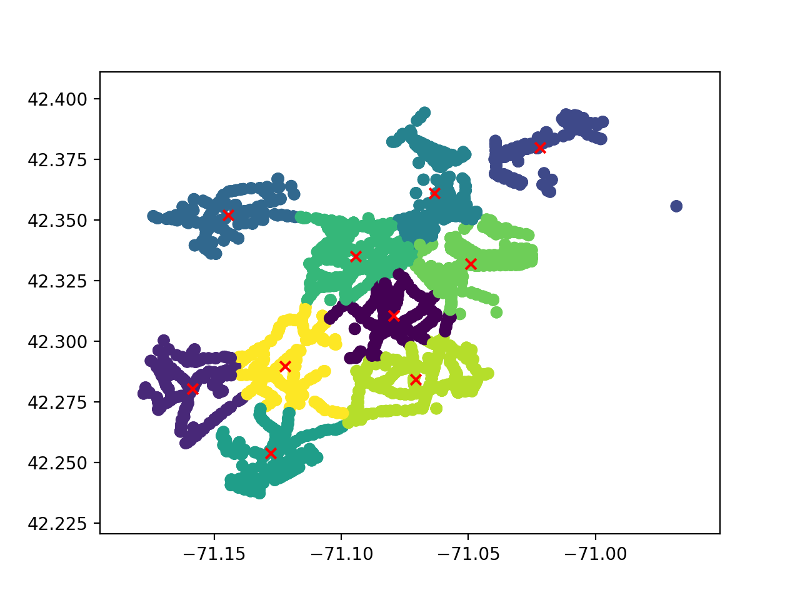
#### *k-means_landmark_transportation_crime.py* (with landmark data, crime data and transportation data.:
- K-means algorithm for finding clusters of landmarks and transportations (bus & train) where
- landmark or transportation coordinates close to crime coordinates are removed 
- locates K coordinates that are centers of the found clusters 
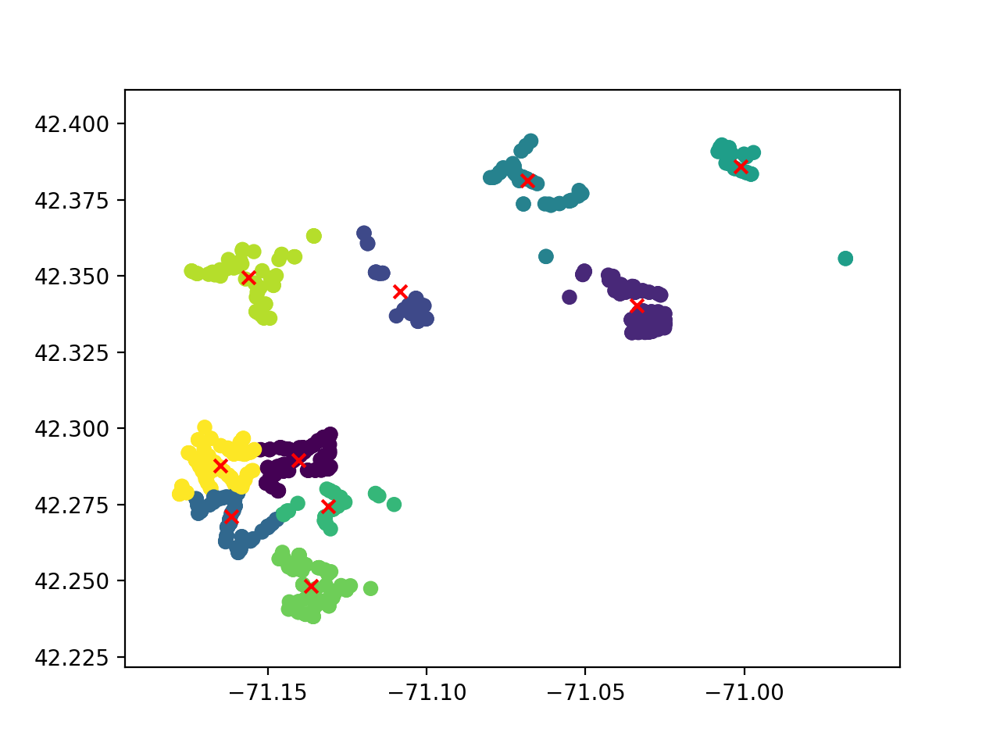

### K-means Analysis
After running the K-means algorithm, we were able to define hard clusters where the coordinates are clustered. We have tested with various value of K to see if results differ and concluded with the result we see above. This result is useful in that we are able to guide the tourists to best possible locations to travel to, which are marked with 'X' in red color on the images above. The 'X' marks are where the K-means algorithm has clustered the coordinates to, thus there will be highest number of landmarks to visit and transportation to utilize around these marked coordinates. 

### statistical analysis or inference algorithm:
There are different variations for the statistics considering whether the user cares for crime or transportation in addition to the scope of landmark coordinates.

*This map image provides key for the usuage of the webplatform and other datasets we have overlooked in this project.*
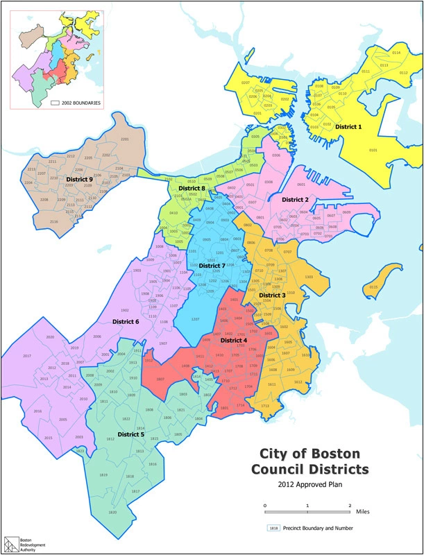

#### *stat_landmark.py*:
- finds the averaging center point of landmarks based on each neighborhood's landmark coordinates
- then finds the average distance to each landmark to the found coordinate

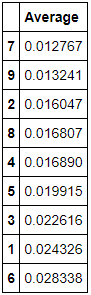
#### *stat_landmark_crime.py*:
- landmark coordinates near crime coordinates are removed
- finds the averaging center point of landmarks based on each neighborhood's landmark coordinates
- then finds the average distance to each landmark to the found coordinate

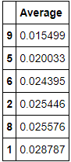
#### *stat_landmark_transportation.py*:
- finds the averaging center point of landmarks and transportations based on each neighborhood's landmark coordinates and transportation coordinates
- then finds the average distance to each landmark and transportation to the found coordinates

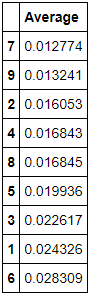
#### *stat_landmark_transportation_crime.py*:
- landmark coordinates near crime coordinates are removed
- finds the averaging center point of landmarks and transportations based on each neighborhood's landmark coordinates and transportation coordinates
- then finds the average distance to each landmark and transportation to the found coordinates

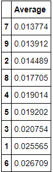

### Statistics Analysis:
Our attempt was to create a rough estimate values to compare with the K-means value. The error in this step of our project is that we have rather created another set of values rather than comparing the K-means values directly, where we have received deduction in grading for Project#2 of the assignment for not providing valid statistics (it was noted that a simple average is not considered to be statistics). However, our objective here was to validate K-means algorithm by checking the results from the K-means to our manually calculated statistics. The result was successful, where we were able to validate the cluster coordinates provided by K-means are the best locations for the tourists to travel to, based on our scope of datasets.

### Interactive Web-based Platform (*Project#3*):
Now that we have validated our algorithms in Project#2 of the project, we were in attempt to create a web-base interactive platform for users to access this data. We have used a tool called MapBox (https://www.mapbox.com/) to map our transformed and calculated datasets on to a map.
When executed, the web-based platform looks like this:

Executing Commands for User-Interactive Web-based Platform is provided in the *Readme.md* in the subdirectory named '*visualizations*'
Two implementations we have made using MapBox has two functionalities of OnMouseOver and OnSubmit.

#### OnMouseOver/OnClick Implementation
On click or on mouse over, we provide counted dataset from Project#1 of our Project where the user could access the total number of landmark coordinates, transportation coordinates and crime coordinates.
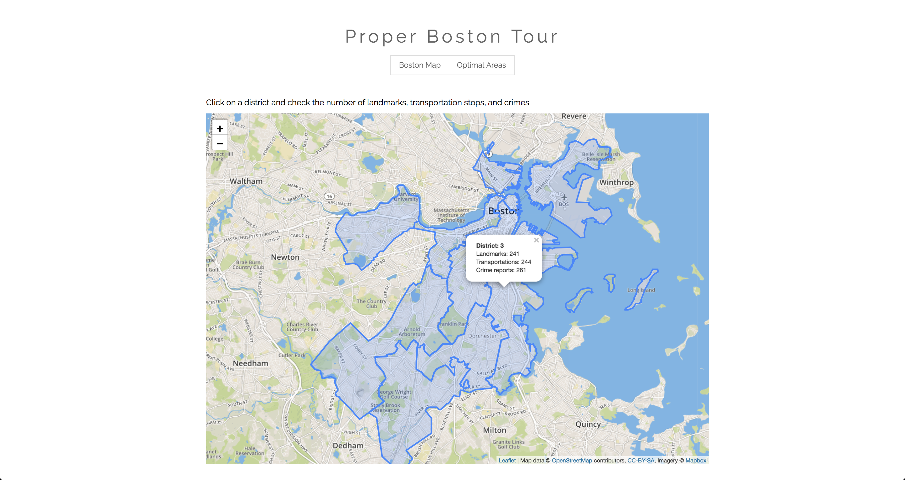
*The image above is the resulting case of OnMouseOver/OnClick Implementation on 'district 3'.*
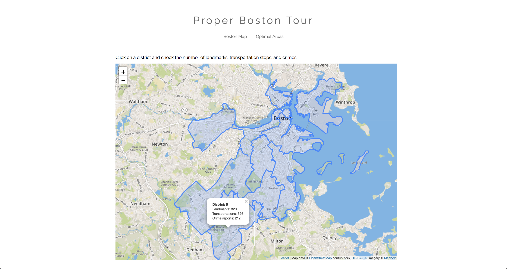
*The image above is the resulting case of OnMouseOver/OnClick Implementation on 'district 5'.*
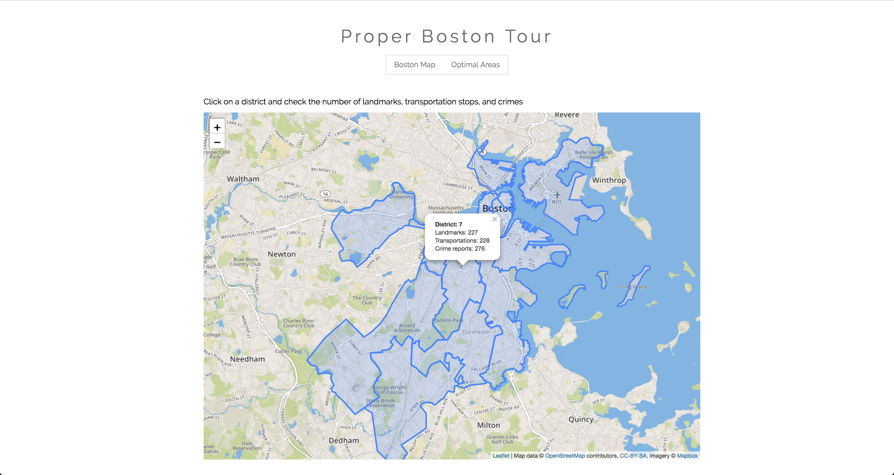
*The image above is the resulting case of OnMouseOver/OnClick Implementation on 'district 7'.*
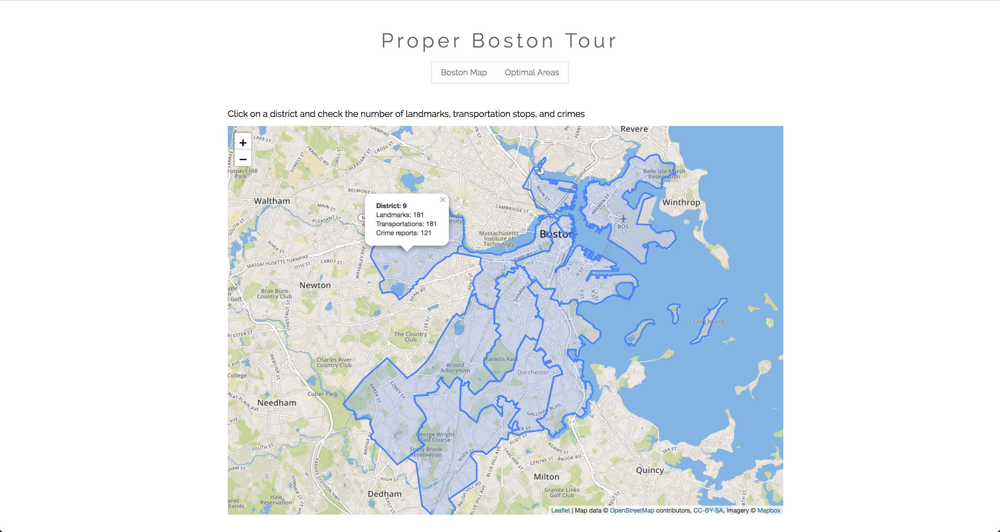
*The image above is the resulting case of OnMouseOver/OnClick Implementation on 'district 9'.*

#### OnSubmit Implementation
OnSubmit Impletation of our web-based platform allows user to mark checkbox for landmark, transportation and crime datasets in their search. Upon checking a box, the algorithm intakes the marked datasets and pulls information from our K-mean variation from our Project#2 to provide the user with the search with requested set of data.

*The image above is the resulting case of OnSubmit Implementation with Datasets: Landmark.*

*The image above is the resulting case of OnSubmit Implementation with Datasets: Landmark and Crime.*
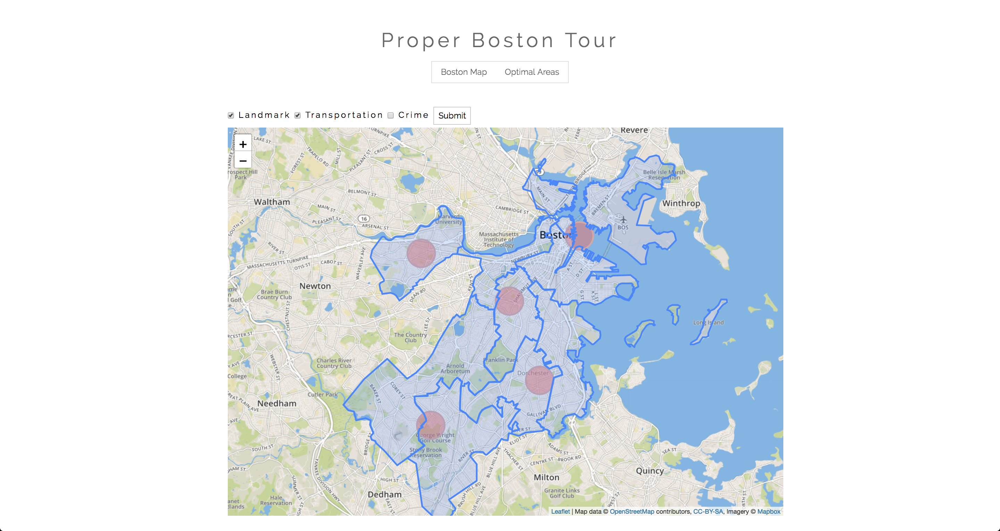
*The image above is the resulting case of OnSubmit Implementation with Datasets: Landmark and Transportations.*

*The image above is the resulting case of OnSubmit Implementation with Datasets: Landmark, Transportations and Crime.*

## Conclusion
Our algorithm is successful in determining best location to travel to, based on our K-means algorithm of finding clusters. However, if the datasets we have incorporated continue to update, we realize that growth of crime would be higher than growth of landmarks. One problem we have is the case where transportation data is not required (upon request of the user). There are not enough landmark coordinates to cover the crime coordinates as we see in *k-means_landmark_crime.py*. In our algorithm to balance the positive(tourists' interests: landmark, transportations) and negative(tourist's worries: crime), the algorithm takes off landmark and transportation coordinates (considered positive value to our algorithm) off our dataset based on crime coordinates(considered negative value to our algorithm). This successfully provides 'Safe Tourism in Boston'. However, in our expectations of the datasets in our near future, landmarks will be removed completely at one point. I think for our project to overcome these problems, there has to be more dataset of positive values incorporated to the project, which would be attractions like shopping districts, university grounds (since Universities are one interest of tourists), and perhaps top-rated restaurants.

Considering such perspectives, our project is useful in fulfilling our project objective, but results are arguable in that our incorporated datasets are limited. An user could definitely find one of the safest and convenient location to trouble in that the suggested location provided by the algorithm will have cluster of landmarks to observe (convenient travel) but in terms of safety, it varies on how many landmark the location's cluster has. For better analysis, future work is suggested on this project to incorporate more datasets that include other possible interests of tourists that we have not overlooked as we have mentioned above.

### Further on Future Works
Our Project translates our datasets and algorithm results over to a map using MapBox but it fails to lead a user directly to an address. For future works, I believe user interaction would be much more efficient if we were to incorporate Google Maps API to guide our user to a specific address.

## Execution Script for Provenance.html:
To execute all the algorithms for the project in an order that respects their explicitly specified data flow dependencies, run the following from the root directory:
```
python3 execute.py soohyeok_soojee
```

## Note:
If you have any suggestions to improve tourist experience or possible dataset to incorporate onto our project please leave a comment on github or send either of us an e-mail
- soohyeok@bu.edu
- soojee@bu.edu
